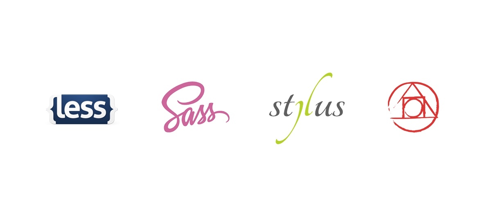

[slug]: talk-about-css-preprocessor
[date]: 2015-09-12T02:16:26

# 聊聊 CSS 预处理器，LESS、Sass、Stylus 及 postCSS



## 先说结论

其实没有一个 CSS 预处理器是完美的，都得按场景来择优。

如果非要推荐一个给新手，那我推荐 [__LESS__](http://lesscss.org/)。 LESS 是这几个里面最均衡最易上手的，其丰富的 [语法糖](http://www.zhihu.com/question/20651624) 也足够你吃上一段时间了。

另外，那些对 LESS、Sass、Stylus 没有概念的同学可以先先看这篇，[Sass vs. LESS vs. Stylus: Preprocessor Shootout](http://code.tutsplus.com/tutorials/sass-vs-less-vs-stylus-a-preprocessor-shootout--net-24320)。


## CSS 预处理器出现之前的黑历史

我 02 年开始接触前端，算下来 10 多年年，从 IE 6 “两只猪”的兼容问题到现在 CSS3 的普及，可以说是看着 CSS 这门语言长大的。

以前没有 CSS 预处理器，所有选择器嵌套只能靠手写，在没有作用域的情况下很容易污染全局（类似于 js 里的全局变量），但更大的问题是不好维护，所以那个时候的 CSS 代码在大多都是一次性的。

Qzone 前端团队在当时算国内技术较为高级的，他们也吐槽 CSS 的不便说：

> 我们很少写 CSS 全局模块，哪里有需要，就写哪里，从来不敢放全局。几百个业务 CSS 的情况下，debug 起来简直就是灾难。

'12 年的时候前端在国内慢慢正规划起来， Bootstrap（以下简称 BS） 这个框架就是在那个时候活起来的，BS 用起来很方便，于是我就想按着 BS 的思路自己也试着实现一套。当时还不知道 CSS 预处理这种东西，看 BS 的 CSS 源码巨复杂，各种混淆以及让人摸不着头脑的浮点数 `line-height`，当时我是真的震惊了！这种高度重复的代码是人写出来的？我吵！要么维护？

然后那年的夏天，一有空就泡在泳池，一下水就看着天花板，满脑子是都是这个“实现自己 BS”问题。结果想了大半个月，粗糙方案很多，完美的那个却一直没想到满意的。直至后来偶然间把 BS 的源码 download 回来看后，才认识了 CSS 预处理这种东西，然后知道了 LESS，真是相见恨晚。


Talk is cheap，来，上代码：

### “现代”样式复用（LESS 语法）

```scss
/*定义一个列表样式*/
.list() {
    background: red;
    color: blue;
}

/*文章里调用list*/
.article {
    .list();
}

/*产品里调用list*/
.product {
    .list();
}
```

CSS 预处理器里我用得最多的其实是服用，可以看到，上面列子很轻易的就在“文章”和“产品”里调用了 `.list()`。

当然，如今看似简单的几行代码在 `纯 CSS 年代`，维护起来简直就是噩梦。想要“文章”和“产品”都拥有 `.list` 的样式就必须分别给他们各模块写上。当 `.list` 样式要修改了，那“文章”和“产品”就得跟着改。

###“旧式”样式复用

其实那个年代也是不乏聪明人的，hack 手法普遍吊。既然 CSS 那么弱，我就从 class 入手吧，比如：

```html
<div class="
    pd25
    mgb10
    bordernone
    text-right
    list
    article
">
    halo
</div>
```

乖乖！ `pd25` 是什么？哈哈，当然是 `padding: 25px` 啦，那 `mgb10`呢，额⋯⋯ 就是 `margin-bottom: 10px`？别笑，当时就是这样处理的，直到现在 bootstrap 身上还有类似身影，只不过规范得更加合理了。

所以，当这么多问题摆在面前需要去解决的时候，CSS预处理器自然应运而生。


## Sass 还是 LESS？

Sass 诞生于 Ruby 社区，众所周知 Ruby 写代码很爽，但是跑得很慢。Sass 的编译器最开始只有 Ruby 版。所以每次保存后， Ruby 版 Sass 编译器要等几秒才能编译完成，体验及其糟糕！

但好在我使用 Sass 的时候， LESS 早已出来。

LESS 的速度目测是 Sass 的 10 倍！！无论 LESS 源码多大，基本都能在 1 秒内完成编译。总之我在切浏览器按下刷新的时候 CSS 早已是最新状态。这点让我感觉非常非常爽！而 LESS 与 Sass 语法的差异最大的不同就是变量符号，从 `$` 变成了 `@` ，批量替换一下就可以了，

总之，直到现在我都还是 Sass 一生黑，碰都不敢碰。

> PS：其实现在 Sass 已经有 nodejs 版本的编译器了，速度与 LESS 基本持平，而且因为 Sass 比 LESS 强大许多，加之bootstrap 4 又要从 LESS 换回 Sass，估计今后两年又是 Sass 的天下。

## Stylus 呢？

看了几分钟手册，没明白在写什么，就放弃掉了，不过还是有很多 nodejs 的死忠会去用它，它有各种 API 啊，.set 方法啊，之类很偏程序的东西，新手还是别把自己绕进去了。


## 最后说说 postCSS

postCSS 算是最近才出来的东西，非常新，自由度绝对是最大的。比如想要自动前缀功能，就引用下 `autoprefixer` 插件就好。

其实 postCSS 本质和 gulp（或grunt、etc⋯⋯） 的机制很像，而且本来就是依赖 gulp 的。很多 postCSS 的插件作者本身就是 gulp 插件的原作者。

说到底，postCSS 更像是把 gulp 等批处理 CSS 方面的部分做了一次梳理而已。而且 postCSS 学习成本肯定是在 LESS 和 Sass 之上，且国内可能都找不到支持它的团队。

所以⋯⋯ 过两年再看吧，希望它不是下一门还没来得及学就过时了的前端技术：）