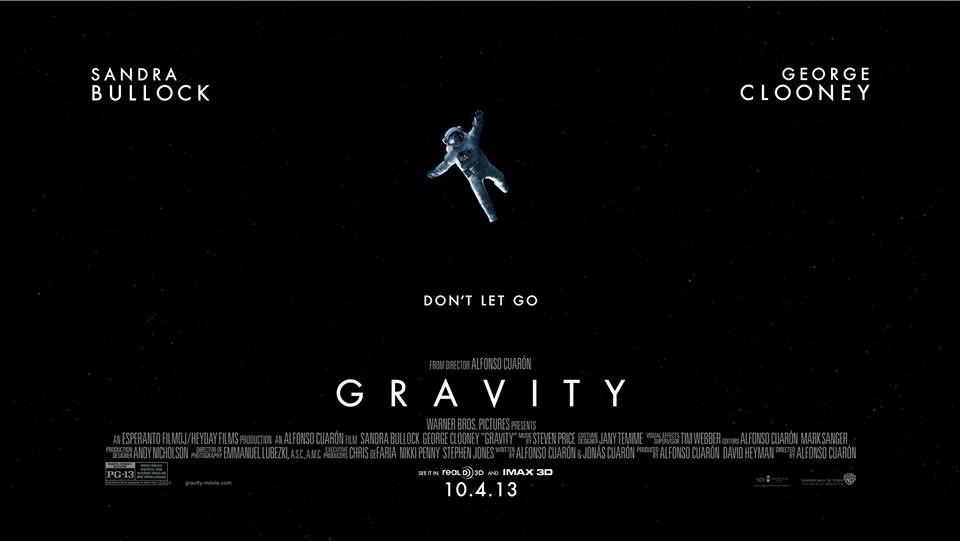

[slug]: gravity
[date]: 2014-07-22T02:16:26

# 地心引力

没什么好说的，这真是一次百元级的太空之旅。

我想，编剧一定是个心理学家，剧情中，穿插着大量矛盾的心理情绪，忽快忽慢逗你玩的情景随处可见。

虽然一开始就猜到导演的手法但心里依然跟着紧张。这种感觉很好。编剧赞！

在太空上的短短几个小时，宇航员是那么的无助，太空上刚好与地球相反的引力非常可怕，如果没有了反重力设备，比如灭火器，推进器，基本上等于被判了死刑。死亡后漂浮在浩荡的宇宙中，对，是黑色。

小的时候，好想地球失去地心引力，天真的以为这样就可以飞起来，然后就可以很轻易的游走到不同的地方了。初中打 CS 的时候，也要用修改器把地心引力去掉，试一把一越不着地的感觉。

看完全片，对空间站总算有个了解。失重真不是闹着玩。活在有重力的地球上，很踏实，莫名的感到了幸福。

“从上面看母亲，美极了。”

