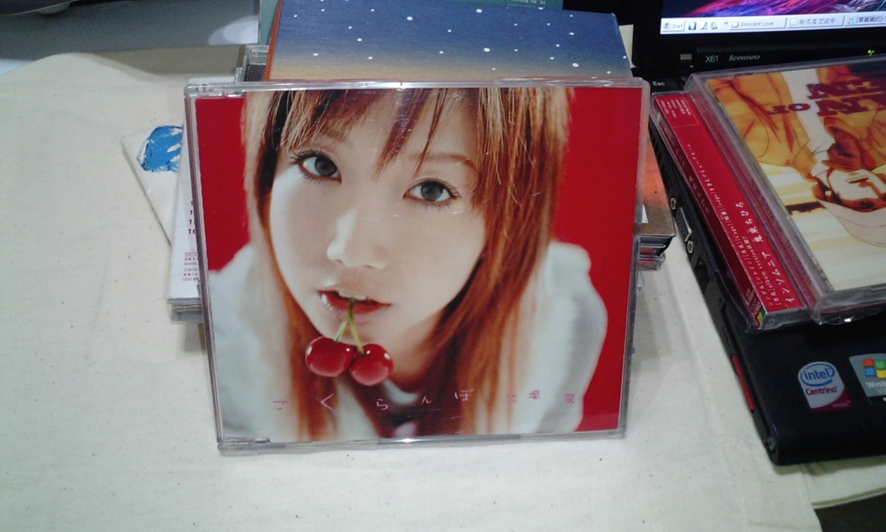
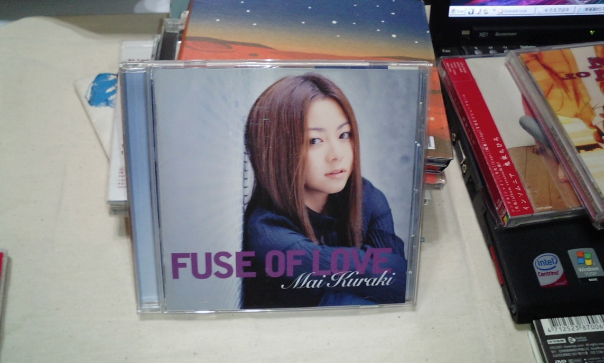
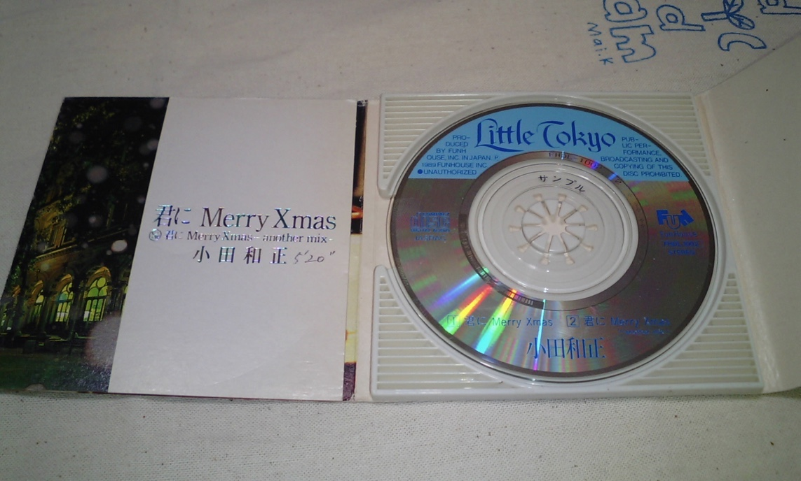

[slug]: cd
[date]: 2013-02-12T02:16:26

# 打口 CD

广州天河，济南大学附近某小店淘到的。打口 CD。贵的几十快钱一盘，上面这张 8CM，五块钱就拿走了。

我找大冢爱同学的 Sakurabo 单曲好久了。

今天终于发现了热泪 10 快钱收下再来就是仓木的几张百听不厌大碟。

都是日本原版碟加起来快 10000 日元 还是用 CD 机听 CD 碟片的时光美好呢 我喜欢那种静静的音乐共振。

大冢爱在 Sakurabo 时期的声音好好笑，而且还带点关西腔有 Demo 的感觉呢？这种怕是在网上爬不到的音乐。

现在算是被我拥有且感知到了。而且看着那些做工精良的歌词小册，好幸福。

星期天，开心。

