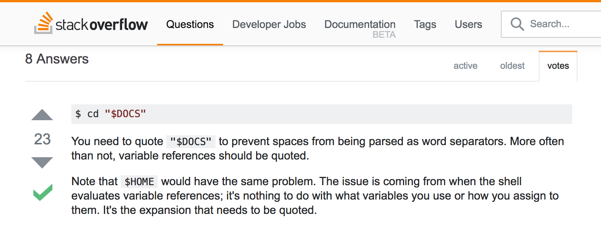
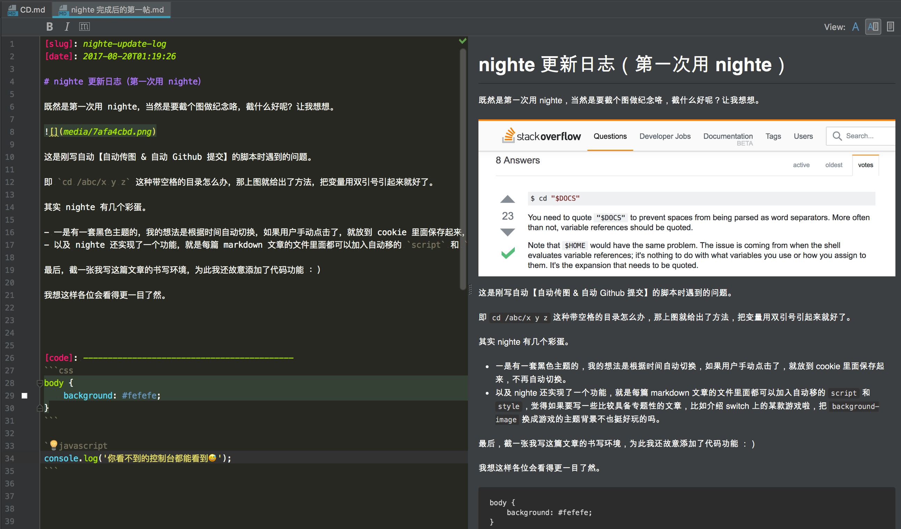

[slug]: nighte-update-log
[date]: 2017-08-20T01:19:26

# nighte 更新日志（第一次用 nighte）

既然是第一次用 nighte，当然是要截个图做纪念咯，截什么好呢？让我想想。



这是刚写自动【自动传图 & 自动 Github 提交】的脚本时遇到的问题。

即 `cd /abc/x y z` 这种带空格的目录怎么办，那上图就给出了方法，把变量用双引号引起来就好了。

其实 nighte 有几个彩蛋。

- 有一套黑色主题的，我的想法是根据时间自动切换，如果用户手动点击 day/night，就记到 cookie 里面，不再自动切换。
- 以及 nighte 还实现了一小个功能，就是每篇 markdown 文章的文件里面都可以加入自定义的 `script` 和 `style`，觉得如果要写一些比较具备专题性的文章，比如介绍 switch 上的游戏“马里奥”啦，把 `background-image` 换成“马里奥”的主题背景不也挺好玩的吗。

最后，截一张我写这篇文章的书写环境，为此我还故意添加了那个代码小功能 ：）

我想这样各位会看得更一目了然。



最最后，nighte 只是一个小小的 markdown to HTML 工具，涉及主文件只有两个 js，陆陆续续写了一个星期，其实大部分时间都花在了主题的微调上，看着这稍显简陋的主题，各位绝难想象到其中的龟毛与艰辛。hhh 😂

不过，现在总算完成了，对不对。所有的铺垫就是为了看书时能记得记笔记以及回报给万维网。OK，nighte！


[code]: -------------------------------------------
```css
body {
    background: #fefefe;
}
```

```javascript
console.log('你看不到的控制台都能看到😅');
```


