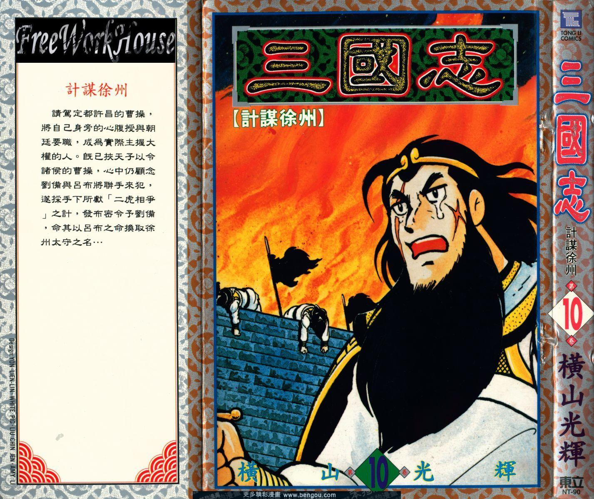

[slug]: sangoku
[date]: 2014-11-10T02:16:26

# 横山光辉和他的『三国志』

今天偶然发现东映的三国不是横山光辉画的，然后特意到了 youtube 找了横山光辉的『三国志』，哇勒，风格大变，有点类似『中华小当家』的风格，也就是更 Q 了。这点让我很喜欢。

这部『三国志』动画片一共 47 集，而我现在才看到 21 集，如果不是昨晚弄 GAE goagent 通宵了，可能会看更多。

无论如何，周三前要看完他。然后就是看横山光辉的『织田信长』，再然后我想把他的『德川家康』和『武田信玄』也看了，忽然觉得横山老师很厉害，一个人居然画了那么多忠于历史原著的动漫。

只可惜他老人家 04 年家中发生大火，被烧死了，由于古代战争画面也有很多纵火画面，所以每次看到纵火的画面都会想到横山老师，真是悲惨的命运啊。