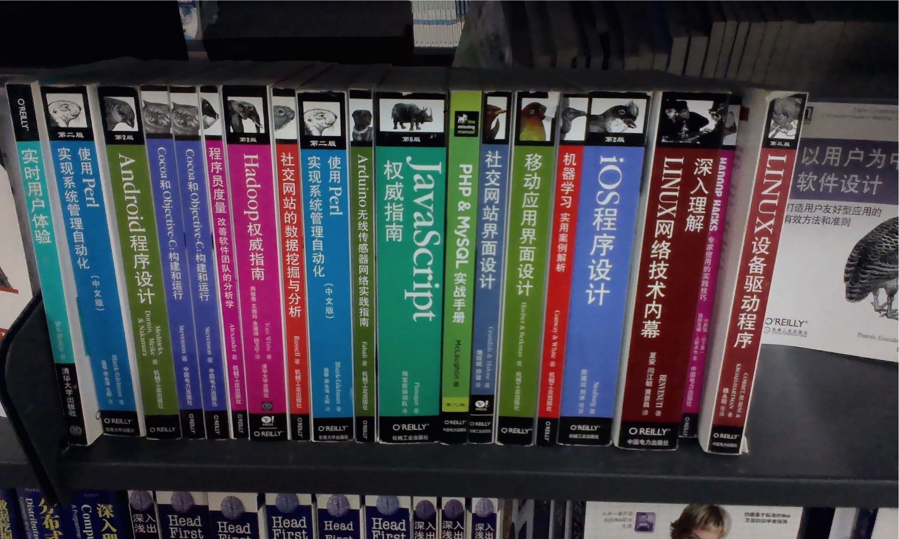

[slug]: shenzhen-off-book-night
[date]: 2014-11-29T02:16:26

# 深圳书城打折未眠夜

图：众动物书中，犀牛书真是翘楚，那么厚厚厚一本。

因为前两个星期看到有 68 折活动日的消息，所以今天特别去了。

其实也没买多少，本来想买：

- __紫龙书__（编译原理第三版，想了一下，放弃了，我不是做编程的可能也实在看不下去。。）
- __犀牛书__（Javascript 大全，发现之前 kindle 打折买了，而且没几次翻开，就又没买。）

最后最后，就买了本 RESTfull API 设计相关的动物书，。别的书都是关于商业奇谈的，感觉想写出优秀的站点，做出优雅的用户体验还得从平实的方向入手才对，总是互联网、程序员思维更本行不通。